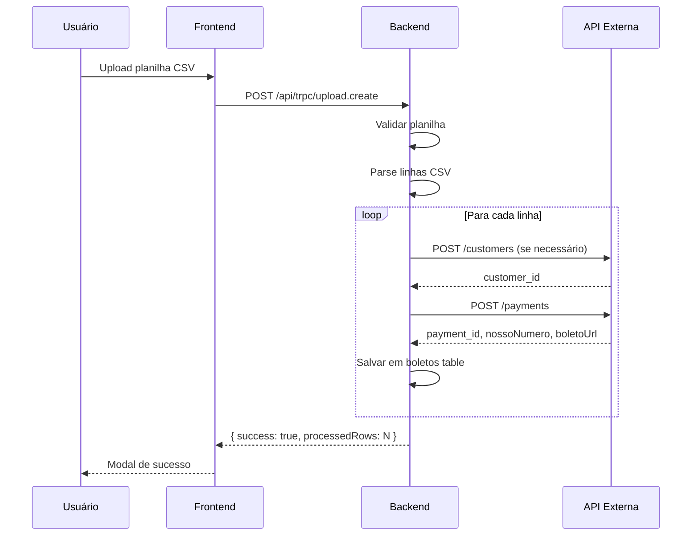
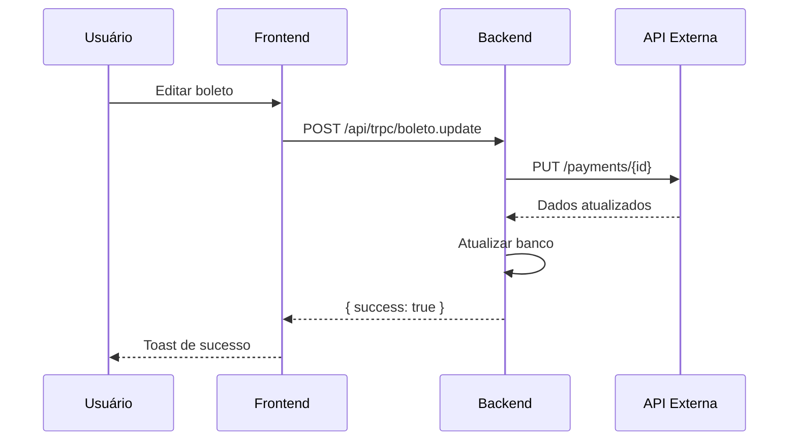
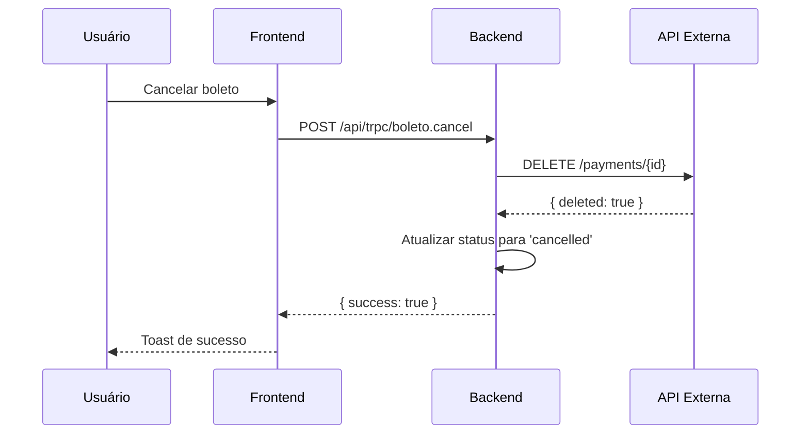

# Especificação de Integração de APIs - ConectaAPI

Este documento detalha todas as chamadas de API necessárias para integrar o sistema ConectaAPI com os provedores de pagamento **Asaas** e **Cobre Fácil**.

---

## Índice

1. [Visão Geral](#visão-geral)
2. [Autenticação](#autenticação)
3. [APIs do Asaas](#apis-do-asaas)
4. [APIs do Cobre Fácil](#apis-do-cobre-fácil)
5. [Fluxo de Integração](#fluxo-de-integração)
6. [Webhooks](#webhooks)
7. [Tratamento de Erros](#tratamento-de-erros)

---

## Visão Geral

O ConectaAPI precisa integrar com APIs de pagamento para:

- **Criar boletos** (individualmente ou em lote via upload de planilha)
- **Consultar status** de boletos existentes
- **Atualizar informações** de boletos (valor, vencimento, dados do cliente)
- **Cancelar boletos** que não serão mais utilizados
- **Receber notificações** (webhooks) sobre mudanças de status (pagamento, vencimento, etc.)

---

## Autenticação

### Asaas

**Tipo:** API Key (Bearer Token)

**Headers necessários:**
```http
Authorization: Bearer {API_KEY}
Content-Type: application/json
```

**Configuração no sistema:**
- API Key: Armazenada em `apiConfigurations.apiKey`
- API Secret: Armazenada em `apiConfigurations.apiSecret` (se necessário)

### Cobre Fácil

**Tipo:** API Key + Secret

**Headers necessários:**
```http
X-Api-Key: {API_KEY}
X-Api-Secret: {API_SECRET}
Content-Type: application/json
```

**Configuração no sistema:**
- API Key: Armazenada em `apiConfigurations.apiKey`
- API Secret: Armazenada em `apiConfigurations.apiSecret`

---

## APIs do Asaas

### 1. Criar Boleto (Individual)

**Endpoint:** `POST https://api.asaas.com/v3/payments`

**Payload de Envio:**
```json
{
  "customer": "{customer_id}",
  "billingType": "BOLETO",
  "value": 150.00,
  "dueDate": "2025-12-31",
  "description": "Cobrança referente ao serviço X",
  "externalReference": "{nosso_numero}",
  "postalService": false
}
```

**Campos obrigatórios:**
- `customer` (string): ID do cliente no Asaas (precisa criar cliente primeiro)
- `billingType` (string): Sempre "BOLETO"
- `value` (number): Valor do boleto em reais
- `dueDate` (string): Data de vencimento no formato YYYY-MM-DD

**Resposta Esperada (201 Created):**
```json
{
  "object": "payment",
  "id": "pay_1234567890",
  "dateCreated": "2025-11-12",
  "customer": "cus_000005678910",
  "value": 150.00,
  "netValue": 148.50,
  "originalValue": null,
  "interestValue": null,
  "description": "Cobrança referente ao serviço X",
  "billingType": "BOLETO",
  "status": "PENDING",
  "dueDate": "2025-12-31",
  "originalDueDate": "2025-12-31",
  "invoiceUrl": "https://www.asaas.com/i/1234567890",
  "bankSlipUrl": "https://www.asaas.com/b/pdf/1234567890",
  "identificationField": "34191234567890123456789012345678901234567890",
  "nossoNumero": "000001234567"
}
```

**Dados a armazenar no banco:**
- `id` → `boletos.externalId`
- `nossoNumero` → `boletos.nossoNumero`
- `bankSlipUrl` → `boletos.boletoUrl`
- `identificationField` → `boletos.barcode`
- `status` → `boletos.status` (converter: PENDING → pending, RECEIVED → paid, OVERDUE → overdue)

---

### 2. Criar Cliente (Pré-requisito para criar boleto)

**Endpoint:** `POST https://api.asaas.com/v3/customers`

**Payload de Envio:**
```json
{
  "name": "João Silva Comércio LTDA",
  "email": "joao.silva@empresa.com",
  "cpfCnpj": "12.345.678/0001-90",
  "phone": "11987654321",
  "mobilePhone": "11987654321",
  "notificationDisabled": false
}
```

**Resposta Esperada (201 Created):**
```json
{
  "object": "customer",
  "id": "cus_000005678910",
  "dateCreated": "2025-11-12",
  "name": "João Silva Comércio LTDA",
  "email": "joao.silva@empresa.com",
  "cpfCnpj": "12345678000190"
}
```

**Nota:** O `customer.id` deve ser usado ao criar o boleto.

---

### 3. Consultar Boleto

**Endpoint:** `GET https://api.asaas.com/v3/payments/{payment_id}`

**Resposta Esperada (200 OK):**
```json
{
  "object": "payment",
  "id": "pay_1234567890",
  "status": "RECEIVED",
  "value": 150.00,
  "dueDate": "2025-12-31",
  "paymentDate": "2025-12-30",
  "confirmedDate": "2025-12-30"
}
```

**Uso:** Sincronizar status de boletos periodicamente ou sob demanda.

---

### 4. Atualizar Boleto

**Endpoint:** `POST https://api.asaas.com/v3/payments/{payment_id}`

**Payload de Envio:**
```json
{
  "value": 200.00,
  "dueDate": "2026-01-31",
  "description": "Cobrança atualizada"
}
```

**Resposta Esperada (200 OK):**
```json
{
  "object": "payment",
  "id": "pay_1234567890",
  "value": 200.00,
  "dueDate": "2026-01-31",
  "status": "PENDING"
}
```

**Nota:** Apenas boletos com status PENDING podem ser atualizados.

---

### 5. Cancelar Boleto

**Endpoint:** `DELETE https://api.asaas.com/v3/payments/{payment_id}`

**Resposta Esperada (200 OK):**
```json
{
  "deleted": true,
  "id": "pay_1234567890"
}
```

**Uso:** Cancelar boleto no Asaas quando o usuário cancelar no sistema.

---

### 6. Criar Boletos em Lote

**Endpoint:** `POST https://api.asaas.com/v3/payments/batch`

**Payload de Envio:**
```json
{
  "payments": [
    {
      "customer": "cus_000005678910",
      "billingType": "BOLETO",
      "value": 150.00,
      "dueDate": "2025-12-31",
      "externalReference": "2025001"
    },
    {
      "customer": "cus_000005678911",
      "billingType": "BOLETO",
      "value": 250.00,
      "dueDate": "2025-12-31",
      "externalReference": "2025002"
    }
  ]
}
```

**Resposta Esperada (200 OK):**
```json
{
  "object": "list",
  "hasMore": false,
  "totalCount": 2,
  "limit": 100,
  "offset": 0,
  "data": [
    {
      "id": "pay_1234567890",
      "status": "PENDING",
      "externalReference": "2025001"
    },
    {
      "id": "pay_1234567891",
      "status": "PENDING",
      "externalReference": "2025002"
    }
  ]
}
```

**Uso:** Processar upload de planilhas com múltiplos boletos.

---

## APIs do Cobre Fácil

### 1. Criar Boleto (Individual)

**Endpoint:** `POST https://api.cobrefacil.com.br/v1/boletos`

**Payload de Envio:**
```json
{
  "sacado": {
    "nome": "João Silva Comércio LTDA",
    "email": "joao.silva@empresa.com",
    "cpf_cnpj": "12345678000190",
    "telefone": "11987654321"
  },
  "valor": 150.00,
  "vencimento": "2025-12-31",
  "descricao": "Cobrança referente ao serviço X",
  "numero_documento": "2025001",
  "multa_percentual": 2.0,
  "juros_mora_percentual": 1.0
}
```

**Campos obrigatórios:**
- `sacado.nome` (string): Nome do cliente
- `sacado.cpf_cnpj` (string): CPF ou CNPJ sem formatação
- `valor` (number): Valor do boleto em reais
- `vencimento` (string): Data de vencimento no formato YYYY-MM-DD
- `numero_documento` (string): Nosso número único

**Resposta Esperada (201 Created):**
```json
{
  "id": "bol_abc123xyz",
  "status": "pendente",
  "valor": 150.00,
  "vencimento": "2025-12-31",
  "nosso_numero": "2025001",
  "linha_digitavel": "34191234567890123456789012345678901234567890",
  "codigo_barras": "34191234567890123456789012345678901234567890",
  "url_boleto": "https://cobrefacil.com.br/boletos/bol_abc123xyz.pdf",
  "criado_em": "2025-11-12T10:30:00Z"
}
```

**Dados a armazenar no banco:**
- `id` → `boletos.externalId`
- `nosso_numero` → `boletos.nossoNumero`
- `url_boleto` → `boletos.boletoUrl`
- `codigo_barras` → `boletos.barcode`
- `status` → `boletos.status` (converter: pendente → pending, pago → paid, cancelado → cancelled, vencido → overdue)

---

### 2. Consultar Boleto

**Endpoint:** `GET https://api.cobrefacil.com.br/v1/boletos/{boleto_id}`

**Resposta Esperada (200 OK):**
```json
{
  "id": "bol_abc123xyz",
  "status": "pago",
  "valor": 150.00,
  "vencimento": "2025-12-31",
  "data_pagamento": "2025-12-30",
  "valor_pago": 150.00
}
```

**Uso:** Sincronizar status de boletos.

---

### 3. Atualizar Boleto

**Endpoint:** `PUT https://api.cobrefacil.com.br/v1/boletos/{boleto_id}`

**Payload de Envio:**
```json
{
  "valor": 200.00,
  "vencimento": "2026-01-31",
  "sacado": {
    "nome": "João Silva Comércio LTDA - Atualizado",
    "email": "joao.novo@empresa.com"
  }
}
```

**Resposta Esperada (200 OK):**
```json
{
  "id": "bol_abc123xyz",
  "status": "pendente",
  "valor": 200.00,
  "vencimento": "2026-01-31"
}
```

**Nota:** Apenas boletos pendentes podem ser atualizados.

---

### 4. Cancelar Boleto

**Endpoint:** `DELETE https://api.cobrefacil.com.br/v1/boletos/{boleto_id}`

**Resposta Esperada (200 OK):**
```json
{
  "id": "bol_abc123xyz",
  "status": "cancelado",
  "cancelado_em": "2025-11-12T15:45:00Z"
}
```

**Uso:** Cancelar boleto quando o usuário solicitar.

---

### 5. Criar Boletos em Lote

**Endpoint:** `POST https://api.cobrefacil.com.br/v1/boletos/lote`

**Payload de Envio:**
```json
{
  "boletos": [
    {
      "sacado": {
        "nome": "Cliente 1",
        "cpf_cnpj": "12345678000190",
        "email": "cliente1@email.com"
      },
      "valor": 150.00,
      "vencimento": "2025-12-31",
      "numero_documento": "2025001"
    },
    {
      "sacado": {
        "nome": "Cliente 2",
        "cpf_cnpj": "98765432000110",
        "email": "cliente2@email.com"
      },
      "valor": 250.00,
      "vencimento": "2025-12-31",
      "numero_documento": "2025002"
    }
  ]
}
```

**Resposta Esperada (200 OK):**
```json
{
  "lote_id": "lote_xyz789",
  "total": 2,
  "sucesso": 2,
  "erros": 0,
  "boletos": [
    {
      "id": "bol_abc123",
      "numero_documento": "2025001",
      "status": "pendente"
    },
    {
      "id": "bol_abc124",
      "numero_documento": "2025002",
      "status": "pendente"
    }
  ]
}
```

**Uso:** Processar upload de planilhas.

---

## Fluxo de Integração

### 1. Upload de Planilha



### 2. Edição de Boleto



### 3. Cancelamento de Boleto



---

## Webhooks

Para receber notificações automáticas sobre mudanças de status dos boletos, é necessário configurar webhooks nas plataformas.

### Asaas Webhook

**URL do Webhook:** `https://seu-dominio.com/api/webhooks/asaas`

**Eventos a escutar:**
- `PAYMENT_RECEIVED` - Boleto foi pago
- `PAYMENT_OVERDUE` - Boleto venceu
- `PAYMENT_DELETED` - Boleto foi cancelado

**Payload recebido:**
```json
{
  "event": "PAYMENT_RECEIVED",
  "payment": {
    "id": "pay_1234567890",
    "customer": "cus_000005678910",
    "value": 150.00,
    "netValue": 148.50,
    "status": "RECEIVED",
    "billingType": "BOLETO",
    "confirmedDate": "2025-12-30",
    "paymentDate": "2025-12-30"
  }
}
```

**Ação no backend:**
1. Validar assinatura do webhook
2. Buscar boleto por `externalId = payment.id`
3. Atualizar `status` do boleto
4. Retornar 200 OK

### Cobre Fácil Webhook

**URL do Webhook:** `https://seu-dominio.com/api/webhooks/cobrefacil`

**Eventos a escutar:**
- `boleto.pago` - Boleto foi pago
- `boleto.vencido` - Boleto venceu
- `boleto.cancelado` - Boleto foi cancelado

**Payload recebido:**
```json
{
  "evento": "boleto.pago",
  "boleto": {
    "id": "bol_abc123xyz",
    "nosso_numero": "2025001",
    "valor": 150.00,
    "valor_pago": 150.00,
    "data_pagamento": "2025-12-30T14:30:00Z",
    "status": "pago"
  }
}
```

**Ação no backend:**
1. Validar assinatura do webhook
2. Buscar boleto por `externalId = boleto.id`
3. Atualizar `status` do boleto
4. Retornar 200 OK

---

## Tratamento de Erros

### Códigos de Erro Comuns

| Código | Significado | Ação |
|--------|-------------|------|
| 400 | Bad Request - Dados inválidos | Validar payload antes de enviar |
| 401 | Unauthorized - Credenciais inválidas | Verificar API Key/Secret |
| 403 | Forbidden - Sem permissão | Verificar permissões da conta |
| 404 | Not Found - Recurso não existe | Verificar se ID está correto |
| 422 | Unprocessable Entity - Regra de negócio violada | Mostrar mensagem de erro ao usuário |
| 429 | Too Many Requests - Rate limit | Implementar retry com backoff |
| 500 | Internal Server Error | Retry após alguns segundos |

### Exemplo de Resposta de Erro (Asaas)

```json
{
  "errors": [
    {
      "code": "invalid_value",
      "description": "O valor do boleto deve ser maior que R$ 5,00"
    }
  ]
}
```

### Exemplo de Resposta de Erro (Cobre Fácil)

```json
{
  "erro": true,
  "mensagem": "CPF/CNPJ inválido",
  "codigo": "INVALID_DOCUMENT"
}
```

### Estratégia de Retry

Para erros temporários (429, 500, 503):

1. Aguardar 1 segundo
2. Tentar novamente (máximo 3 tentativas)
3. Se falhar após 3 tentativas, marcar como erro e notificar usuário

---

## Resumo de Endpoints Necessários

### Asaas

| Operação | Método | Endpoint |
|----------|--------|----------|
| Criar cliente | POST | `/v3/customers` |
| Criar boleto | POST | `/v3/payments` |
| Criar lote | POST | `/v3/payments/batch` |
| Consultar boleto | GET | `/v3/payments/{id}` |
| Atualizar boleto | POST | `/v3/payments/{id}` |
| Cancelar boleto | DELETE | `/v3/payments/{id}` |

### Cobre Fácil

| Operação | Método | Endpoint |
|----------|--------|----------|
| Criar boleto | POST | `/v1/boletos` |
| Criar lote | POST | `/v1/boletos/lote` |
| Consultar boleto | GET | `/v1/boletos/{id}` |
| Atualizar boleto | PUT | `/v1/boletos/{id}` |
| Cancelar boleto | DELETE | `/v1/boletos/{id}` |

---

## Próximos Passos

1. **Implementar cliente HTTP** para cada API (Asaas e Cobre Fácil)
2. **Criar funções auxiliares** para conversão de dados entre o formato do sistema e das APIs
3. **Implementar endpoints de webhook** para receber notificações
4. **Adicionar validação** de assinatura de webhooks
5. **Implementar retry logic** para chamadas de API
6. **Adicionar logs** de todas as chamadas de API para auditoria
7. **Criar testes** para cada integração

---

**Documento criado em:** 12/11/2025  
**Versão:** 1.0  
**Autor:** ConectaAPI Development Team
