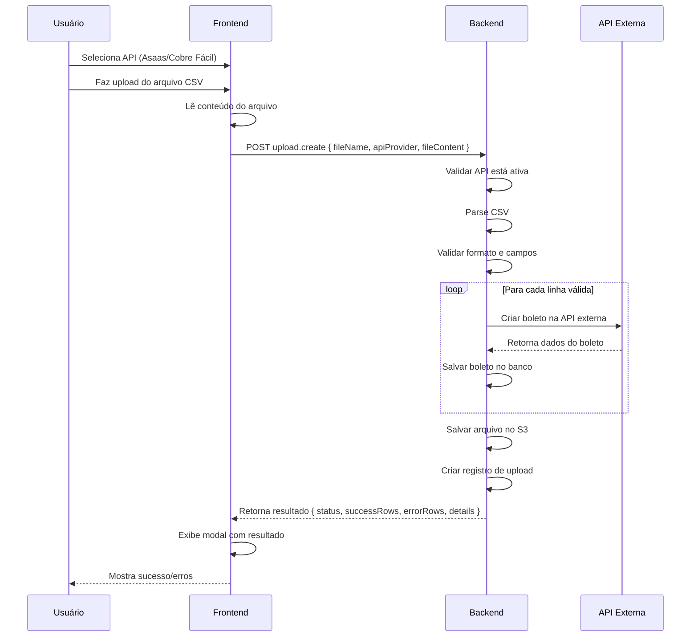

# Contrato Frontend ↔ Backend - Dashboard e Upload CSV

Este documento especifica o contrato entre Frontend e Backend para as funcionalidades de **Dashboard** e **Upload de Planilhas CSV**.

---

## Índice

1. [Dashboard](#dashboard)
   - [Estatísticas Gerais](#1-estatísticas-gerais)
   - [Últimos Uploads](#2-últimos-uploads)
2. [Upload de CSV](#upload-de-csv)
   - [Criar Upload](#3-criar-upload)
   - [Listar Uploads](#4-listar-uploads)
   - [Buscar Upload por ID](#5-buscar-upload-por-id)
3. [Tipos de Dados](#tipos-de-dados)
4. [Formato da Planilha CSV](#formato-da-planilha-csv)

---

## Dashboard

### 1. Estatísticas Gerais

**Operação:** Buscar estatísticas para exibir no dashboard

**Chamada Frontend:**
```typescript
const { data, isLoading } = trpc.dashboard.stats.useQuery();
```

**O que o Frontend ENVIA:**
```typescript
// Nada - query sem parâmetros
```

**O que o Backend RETORNA:**
```typescript
{
  // APIs
  activeApis: 2, // número de APIs configuradas e ativas
  
  // Uploads
  totalUploads: 15, // total de uploads feitos pelo usuário
  successfulUploads: 12, // uploads com status "success"
  failedUploads: 3, // uploads com status "error"
  successRate: 80, // porcentagem (12/15 * 100)
  
  // Boletos
  totalBoletos: 150, // total de boletos cadastrados
  pendingBoletos: 80, // boletos com status "pending"
  paidBoletos: 50, // boletos com status "paid"
  cancelledBoletos: 10, // boletos com status "cancelled"
  overdueBoletos: 10, // boletos com status "overdue"
  
  // Valores
  totalValue: 15000000, // soma de todos os boletos em centavos (R$ 150.000,00)
  pendingValue: 8000000, // soma dos boletos pendentes em centavos
  paidValue: 5000000, // soma dos boletos pagos em centavos
}
```

**Uso no Frontend:**
- Cards de estatísticas no Dashboard
- Gráficos (futuro)

**Exemplo de uso:**
```typescript
const { data: stats } = trpc.dashboard.stats.useQuery();

// Exibir no card
<Card>
  <CardTitle>APIs Ativas</CardTitle>
  <CardContent>{stats?.activeApis || 0}</CardContent>
</Card>

<Card>
  <CardTitle>Taxa de Sucesso</CardTitle>
  <CardContent>{stats?.successRate || 0}%</CardContent>
</Card>

<Card>
  <CardTitle>Boletos Pendentes</CardTitle>
  <CardContent>{stats?.pendingBoletos || 0}</CardContent>
</Card>
```

---

### 2. Últimos Uploads

**Operação:** Buscar os últimos uploads para exibir no histórico do dashboard

**Chamada Frontend:**
```typescript
const { data } = trpc.dashboard.recentUploads.useQuery({
  limit: 5 // opcional, padrão 5
});
```

**O que o Frontend ENVIA:**
```typescript
{
  limit?: number // opcional, padrão 5
}
```

**O que o Backend RETORNA:**
```typescript
// Array dos últimos uploads
[
  {
    id: 10,
    fileName: "clientes_novos.csv",
    apiProvider: "cobrefacil",
    status: "success", // "success" | "error" | "processing"
    totalRows: 25,
    processedRows: 25,
    successRows: 23,
    errorRows: 2,
    errorMessage: null,
    fileUrl: "https://s3.amazonaws.com/bucket/uploads/clientes_novos.csv",
    createdAt: "2025-11-12T18:03:25.000Z",
    userId: 1
  },
  {
    id: 9,
    fileName: "boletos_urgentes.csv",
    apiProvider: "asaas",
    status: "error",
    totalRows: 10,
    processedRows: 0,
    successRows: 0,
    errorRows: 10,
    errorMessage: "API Key inválida",
    fileUrl: "https://s3.amazonaws.com/bucket/uploads/boletos_urgentes.csv",
    createdAt: "2025-11-11T18:03:25.000Z",
    userId: 1
  },
  // ... mais 3 uploads
]
```

**Uso no Frontend:**
- Seção "Histórico Recente" no Dashboard
- Lista clicável que leva para `/upload/:id`

**Exemplo de uso:**
```typescript
const { data: recentUploads } = trpc.dashboard.recentUploads.useQuery({ limit: 5 });

{recentUploads?.map(upload => (
  <div 
    key={upload.id} 
    onClick={() => setLocation(`/upload/${upload.id}`)}
    className="cursor-pointer"
  >
    <p>{upload.fileName}</p>
    <p>{upload.apiProvider.toUpperCase()}</p>
    <Badge variant={upload.status === 'success' ? 'success' : 'error'}>
      {upload.status}
    </Badge>
  </div>
))}
```

---

## Upload de CSV

### 3. Criar Upload

**Operação:** Fazer upload de planilha CSV e processar boletos

**Chamada Frontend:**
```typescript
const uploadMutation = trpc.upload.create.useMutation();

// 1. Usuário seleciona arquivo
const file = event.target.files[0];

// 2. Ler conteúdo do arquivo
const fileContent = await file.text();

// 3. Enviar para backend
await uploadMutation.mutateAsync({
  fileName: file.name,
  apiProvider: "asaas", // ou "cobrefacil"
  fileContent: fileContent // conteúdo CSV como string
});
```

**O que o Frontend ENVIA:**
```typescript
{
  fileName: string, // nome do arquivo (ex: "clientes.csv")
  apiProvider: "asaas" | "cobrefacil", // API selecionada
  fileContent: string // conteúdo completo do CSV como texto
}
```

**Exemplo de fileContent:**
```csv
nome,email,cpf_cnpj,valor,vencimento
João Silva,joao@email.com,12345678901,150.00,2025-12-31
Maria Santos,maria@email.com,98765432000110,250.50,2025-12-31
Pedro Costa,pedro@email.com,11122233344,100.00,2026-01-15
```

**O que o Backend RETORNA:**
```typescript
{
  id: 11,
  fileName: "clientes.csv",
  apiProvider: "asaas",
  status: "success", // ou "error" se falhou completamente
  totalRows: 3, // total de linhas no CSV (excluindo cabeçalho)
  processedRows: 3, // linhas processadas
  successRows: 2, // boletos criados com sucesso
  errorRows: 1, // linhas com erro
  errorMessage: null, // ou mensagem de erro se status = "error"
  fileUrl: "https://s3.amazonaws.com/bucket/uploads/clientes_1731432205.csv",
  createdAt: "2025-11-12T19:30:05.000Z",
  userId: 1,
  
  // Detalhes do processamento (opcional, para exibir no modal)
  details: {
    errors: [
      {
        row: 2,
        customerName: "Maria Santos",
        error: "CPF/CNPJ inválido"
      }
    ],
    success: [
      {
        row: 1,
        customerName: "João Silva",
        boletoId: 25,
        nossoNumero: "2025025"
      },
      {
        row: 3,
        customerName: "Pedro Costa",
        boletoId: 26,
        nossoNumero: "2025026"
      }
    ]
  }
}
```

**Uso no Frontend:**
- Tela de Upload de Planilhas
- Modal de resultado mostrando sucesso/erros

**Exemplo de uso:**
```typescript
const uploadMutation = trpc.upload.create.useMutation();

const handleUpload = async (file: File, apiProvider: string) => {
  try {
    const fileContent = await file.text();
    
    const result = await uploadMutation.mutateAsync({
      fileName: file.name,
      apiProvider,
      fileContent
    });
    
    // Mostrar modal de sucesso
    setModalData({
      status: result.status,
      totalRows: result.totalRows,
      successRows: result.successRows,
      errorRows: result.errorRows,
      details: result.details
    });
    setShowModal(true);
    
  } catch (error) {
    toast.error('Erro ao processar upload');
  }
};
```

---

### 4. Listar Uploads

**Operação:** Buscar todos os uploads do usuário

**Chamada Frontend:**
```typescript
const { data, isLoading } = trpc.upload.list.useQuery();
```

**O que o Frontend ENVIA:**
```typescript
// Nada - query sem parâmetros
```

**O que o Backend RETORNA:**
```typescript
// Array de uploads
[
  {
    id: 10,
    fileName: "clientes_novos.csv",
    apiProvider: "cobrefacil",
    status: "success",
    totalRows: 25,
    processedRows: 25,
    successRows: 23,
    errorRows: 2,
    errorMessage: null,
    fileUrl: "https://s3.amazonaws.com/bucket/uploads/clientes_novos.csv",
    createdAt: "2025-11-12T18:03:25.000Z",
    userId: 1
  },
  // ... mais uploads
]
```

**Uso no Frontend:**
- Dashboard (últimos uploads)
- Página de histórico de uploads (futuro)

---

### 5. Buscar Upload por ID

**Operação:** Buscar detalhes de um upload específico e seus boletos

**Chamada Frontend:**
```typescript
const { data } = trpc.upload.getById.useQuery({
  id: 10
});
```

**O que o Frontend ENVIA:**
```typescript
{
  id: number // obrigatório
}
```

**O que o Backend RETORNA:**
```typescript
{
  // Dados do upload
  upload: {
    id: 10,
    fileName: "clientes_novos.csv",
    apiProvider: "cobrefacil",
    status: "success",
    totalRows: 25,
    processedRows: 25,
    successRows: 23,
    errorRows: 2,
    errorMessage: null,
    fileUrl: "https://s3.amazonaws.com/bucket/uploads/clientes_novos.csv",
    createdAt: "2025-11-12T18:03:25.000Z",
    userId: 1
  },
  
  // Boletos gerados por este upload
  boletos: [
    {
      id: 1,
      nossoNumero: "2025001",
      apiProvider: "cobrefacil",
      customerName: "João Silva",
      customerEmail: "joao@email.com",
      customerDocument: "12345678901",
      value: 15000,
      dueDate: "2025-12-31T00:00:00.000Z",
      status: "pending",
      externalId: "bol_abc123",
      barcode: "34191234567890123456789012345678901234567890",
      boletoUrl: "https://cobrefacil.com.br/boletos/bol_abc123.pdf",
      uploadId: 10,
      createdAt: "2025-11-12T18:03:25.000Z",
      updatedAt: "2025-11-12T18:03:25.000Z",
      userId: 1
    },
    // ... mais 22 boletos
  ]
}
```

**Uso no Frontend:**
- Página de detalhes do upload (`/upload/:id`)
- Tabela de boletos gerados
- Estatísticas do upload

---

## Tipos de Dados

### Upload

```typescript
type Upload = {
  id: number;
  fileName: string;
  apiProvider: "asaas" | "cobrefacil";
  status: "success" | "error" | "processing";
  totalRows: number;
  processedRows: number;
  successRows: number;
  errorRows: number;
  errorMessage: string | null;
  fileUrl: string | null;
  createdAt: Date;
  userId: number;
};
```

### Upload Status

```typescript
type UploadStatus = "success" | "error" | "processing";
```

**Significado:**
- `success`: Upload processado com sucesso (pode ter algumas linhas com erro)
- `error`: Upload falhou completamente (ex: API inválida, arquivo corrompido)
- `processing`: Upload está sendo processado (para uploads grandes, futuro)

### Dashboard Stats

```typescript
type DashboardStats = {
  // APIs
  activeApis: number;
  
  // Uploads
  totalUploads: number;
  successfulUploads: number;
  failedUploads: number;
  successRate: number; // 0-100
  
  // Boletos
  totalBoletos: number;
  pendingBoletos: number;
  paidBoletos: number;
  cancelledBoletos: number;
  overdueBoletos: number;
  
  // Valores
  totalValue: number; // centavos
  pendingValue: number; // centavos
  paidValue: number; // centavos
};
```

---

## Formato da Planilha CSV

### Estrutura Esperada

**Cabeçalho obrigatório:**
```csv
nome,email,cpf_cnpj,valor,vencimento
```

**Campos:**

| Campo | Tipo | Obrigatório | Descrição | Exemplo |
|-------|------|-------------|-----------|---------|
| `nome` | string | ✅ Sim | Nome do cliente | "João Silva LTDA" |
| `email` | string | ❌ Não | Email do cliente | "joao@empresa.com" |
| `cpf_cnpj` | string | ❌ Não | CPF ou CNPJ (sem formatação) | "12345678901" |
| `valor` | number | ✅ Sim | Valor do boleto em reais | "150.00" ou "150,00" |
| `vencimento` | string | ✅ Sim | Data de vencimento | "2025-12-31" ou "31/12/2025" |

### Exemplo de CSV Válido

```csv
nome,email,cpf_cnpj,valor,vencimento
João Silva Comércio LTDA,joao@empresa.com,12345678000190,150.00,2025-12-31
Maria Santos ME,maria@email.com,98765432000110,250.50,2025-12-31
Pedro Costa,pedro@email.com,11122233344,100.00,2026-01-15
Ana Oliveira,,45678912300,75.00,2025-12-25
Carlos Souza,carlos@email.com,,200.00,2026-01-10
```

### Validações do Backend

O Backend deve validar cada linha e retornar erros específicos:

1. **Nome vazio:** "Nome do cliente é obrigatório"
2. **Valor inválido:** "Valor deve ser um número maior que 0"
3. **Data inválida:** "Data de vencimento inválida"
4. **Data no passado:** "Data de vencimento não pode ser no passado"
5. **CPF/CNPJ inválido:** "CPF/CNPJ inválido" (se fornecido)

### Download de Planilha Exemplo

**Frontend deve fornecer link para download:**

```typescript
// Gerar CSV de exemplo
const exampleCSV = `nome,email,cpf_cnpj,valor,vencimento
João Silva LTDA,joao@empresa.com,12345678000190,150.00,2025-12-31
Maria Santos ME,maria@email.com,98765432000110,250.50,2025-12-31
Pedro Costa,pedro@email.com,11122233344,100.00,2026-01-15`;

// Criar blob e download
const blob = new Blob([exampleCSV], { type: 'text/csv' });
const url = URL.createObjectURL(blob);
const link = document.createElement('a');
link.href = url;
link.download = 'exemplo_planilha.csv';
link.click();
```

**Ou usar link estático:**
```typescript
<a href="/exemplo_planilha.csv" download>
  Baixar planilha exemplo
</a>
```

---

## Fluxo Completo de Upload



---

## Resumo de Operações

### Dashboard

| Operação | Endpoint tRPC | Envia | Recebe |
|----------|---------------|-------|--------|
| Estatísticas | `dashboard.stats` | - | `DashboardStats` |
| Últimos uploads | `dashboard.recentUploads` | `{ limit? }` | `Upload[]` |

### Upload

| Operação | Endpoint tRPC | Envia | Recebe |
|----------|---------------|-------|--------|
| Criar upload | `upload.create` | `{ fileName, apiProvider, fileContent }` | `Upload + details` |
| Listar uploads | `upload.list` | - | `Upload[]` |
| Buscar por ID | `upload.getById` | `{ id }` | `{ upload, boletos[] }` |

---

## Tratamento de Erros

### Erros de Upload

**Backend pode retornar:**

```typescript
// Erro de validação
{
  code: "VALIDATION_ERROR",
  message: "Arquivo CSV inválido: cabeçalho não encontrado"
}

// Erro de API
{
  code: "API_ERROR",
  message: "API Asaas não está configurada ou inativa"
}

// Erro de processamento
{
  code: "PROCESSING_ERROR",
  message: "Erro ao processar linha 5: valor inválido"
}
```

**Frontend deve capturar e exibir:**

```typescript
try {
  await uploadMutation.mutateAsync({ ... });
} catch (error) {
  if (error.code === 'VALIDATION_ERROR') {
    toast.error('Arquivo CSV inválido. Verifique o formato.');
  } else if (error.code === 'API_ERROR') {
    toast.error('Configure a API antes de fazer upload.');
  } else {
    toast.error(error.message || 'Erro ao processar upload');
  }
}
```

---

**Documento criado em:** 12/11/2025  
**Versão:** 1.0  
**Foco:** Contrato Frontend ↔ Backend (Dashboard e Upload CSV)
